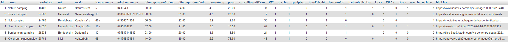

# Projekt Last Minute Camping – Tent Edition

### Zielsetzung

Für die Umsetzung unseres Projekts haben wir uns erneut an folgendem Modell orientiert:

Ziel war eine Datenbank mit der Programmiersprache „Python“ zu erstellen sowie diese ebenfalls via Python zu verwalten. Anschließend sollten die eingepflegten Daten veranschaulicht und mehr oder minder sinnvoll verwendet werden.

### Planung und Entscheidungsfindung

Im ersten Schritt der Planung befassten wir uns mit der Frage, was wir darstellen wollen.\

Da im ersten Halbjahr bereits ein Datenbank-Projekt vorausgegangen war in welchem wir eine mySQL-Datenbank zum Thema „Last-Minute-Camping“ erstellten, war schnell klar, dass wir hier auch wieder ansetzen könnten.  
Die Entscheidung war also gefallen.  
Da wir in den Wochen zuvor bereits daran gearbeitet hatten eine Datenbank in Python zu erstellen war auch der Ausgangspunkt für das Projekt schnell gefunden.  
Um das Projekt überschaubarer und anschaulicher zu halten, als auch aufgrund des knappen Zeitrahmens, entschieden wir uns, keine Kopie der Datenbank aus dem ersten Halbjahr zu erstellen, sondern eine neue, kompaktere Version dieser zu entwickeln. Die „Tent Editon“ war geboren, welche sich ausschließlich auf Camper mit Zelt fokussieren sollte.  
Als Nächstes beschäftigten wir uns mit der sinnvollen Verwendung unserer Datenbank und der enthaltenen Daten. In unserem Projekt im ersten Halbjahr wurden viele Informationen in eine Datenbank eingepflegt und konnten auch jederzeit vom betreffenden Administrator verändert werden, aber von außen einsehen, geschweige denn als möglicher Interessent hiermit zu interagieren war leider nicht möglich. Aber wie wollten wir unsere Daten weiterverarbeiten? Da es sich um eine Übersicht zu Campingplätzen sowie deren freie Kapazitäten handelt war der logische Entschluss unsere Daten für interessierte Camper und Camperinnen zur Verfügung zu stellen. Als eine der geläufigsten Varianten wählten wir eine browserbasierte Webansicht, welche dem zukünftigen Kunden eine intuitive und übersichtliche Darstellung unserer Daten vermitteln würde. Die Umsetzung sollte in „Vue.js“ erfolgen. Dabei handelt es sich um ein sogenanntes JavaScript-Framework, welches die Verknüpfung von HTML-, CSS- und JavaScript-Elementen stark vereinfacht und so auch den Entwicklungsprozess beschleunigt. Der große Vorteil der von uns gewählten Darstellungsform ist zudem, dass unsere Daten in jedem gängigen Internetbrowser visualisiert werden können.
Abschließend stellte sich die Frage, wie wir ein clientseitiges Frontend, welches durch den Webbrowser dargestellt wird mit unserer Datenbank verbinden könnten. Im Normalfall regelt ein Backend den Austausch der Daten zwischen Frontend und der Datenbank. Dies geschieht z.B., um für Sicherheit zu sorgen, da der Quellcode hierdurch nicht einsehbar und manipulierbar wäre oder aber auch um Datenintegrität zu gewährleisten wobei das Backend jeden Datenaustausch validieren würde und dadurch verhindert, dass es bei zeitgleichen Zugriffen verschiedener Benutzer zu Dateninkonsistenzen kommen kann.
Da die zeitlichen Fristen für das Projekt schon sehr knapp erschienen, verwarfen wir aber schnell den Plan ein echtes Backend zu integrieren und suchten nach einer Behelfslösung.
Die Wahl fiel auf eine .JSON-Datei (JavaScript Object Notation) als Zwischenspeicher.
Mit dem Entschluss war die grobe Planung abgeschlossen und die Umsetzung konnte beginnen.

### Umsetzung

Wie in der Planung bereits erwähnt, war unser Ausgangspunkt eine im Voraus erstellte „Personendatenbank“ in welcher wir eine mySQL-Datenbank mit Python erstellen und verwalten. Diese Verknüpfung wurde durch die Python-Bibliothek „mysql-connector“ realisiert. Um die Administration der Datenbank in Python zu ermöglichen wurden folgende Funktionalitäten implementiert:

- Eine Datenbank namens "lastMinuteCampingTentEdition" wird erstellt, sofern sie noch nicht existiert
- Eine Tabelle namens "dataTable" wird erstellt, sofern sie in der Datenbank noch nicht existiert
- Ein Datensatz kann hinzugefügt werden, sofern der gewählte Name in der Datenbank noch nicht existiert
- Ein Campingplatz kann anhand des Namens in der Datenbank gesucht werden (zur Steigerung der Übersichtlichkeit werden die Attribute bei der Ausgabe sinnvoll beschränkt)
- Alle vorhandenen Datensätze können ausgegeben werden (zur Steigerung der Übersichtlichkeit werden hierbei die Attribute sinnvoll beschränkt)
- Die Anzahl freier Campingplätze bereits in der Datenbank existierender Datensätze kann geändert werden
- Datensätze können gelöscht werden
- Zur Veranschaulichung können Testdaten in die Datenbank eingetragen werden

Um die Interaktion angenehmer zu gestalten läuft das Programm in einer "while-Schleife" die erst durch eine manuelle Eingabe beendet werden kann.  
Innerhalb dieser Schleife befindet man sich in einem Optionsmenü.  
Durch Eingabe einer Zahl wird eine bestimmte Option ausgeführt, nachdem anschließend (falls nötig) weitere Parameter hierzu abgefragt werden.  
Welche Option sich hinter welcher Zahl verbirgt wird nach jedem Durchlauf, aufgelistet, angezeigt.  
Da es sich bei den Optionen um sich wiederholende Abläufe handelt, wurden sie in Form von Funktionen in das Programm implementiert.  
Mögliche, folgende Parameter hingegen sind variabel und werden der Funktion daher bei der Ausführung bereitgestellt und berücksichtigt.

Der Datenbank-Server wird in Form eines mySQL-Servers über das frei verfügbare Programm "XAMPP" lokal bereit gestellt.  
Sobald eine Funktion aufgerufen wird, welche mit der Datenbank arbeitet, soll unser Python Programm mit Hilfe des mysql-connectors mit diesem mySQL-Server kommunizieren.
Als relevante Attribute für unsere Datenbank, haben wir uns für die Folgenden entschieden:

- Name des Campingplatzes
- Adresse des Campingplatzes (atomar)
- Telefonnummer
- Öffnungs- und Schließzeiten
- Bewertung
- Preis
- Anzahl freier Zeltplätze
- diverse Extras (WC, dusche, spielplatz, tiereErlaubt, barrierefrei, bademöglichkeit, kiosk, WLAN, strom, waschmaschine)
- Eine BildURL für die spätere Darstellung auf der Webseite

Der Einfachheit halber hat jeder Zeltplatz auf einem Campingplatz zu jeder Zeit den selben Preis, zudem gelten die identischen Öffnungs- und Schließzeiten des ganze Jahr über.
Das Resultat des ersten Aufrufes des Python-Scripts sah nun wie folgt aus:

Durch die Implemierung einer "seeder"-Funktion ist es möglich vordefinierte Testdaten in die Datenbank zu integrieren, welche wir zur Anschauung verwenden wollen.

Als nächstes befassten wir uns mit der Überführung unserer Daten in ein Front-End. Bei uns sollte dies durch das JavaScript-Framework Vue realisiert werden.  
Dadurch, dass das Front-End aber nicht direkt auf die Datenbank zugreifen kann, haben wir uns mit der Erstellung einer "data.json"-Datei als Zwischenspeicher beholfen.
Diese Datei wurde so implementiert, dass sie, jedes Mal wenn wir Daten in die Datenbank übertragen oder vorhandenene Datensätze verändern, geleert wird, die Datenbank erneut ausgelesen wird und die Daten neu in die data.json geschrieben werden.  
Die Funktion welche die Daten aus der Datenbank in data.json schreibt sieht dabei folgendermaßen aus:

Als Ergebnis erhalten wir folgendes Datenformat mit welchem wir in Vue weiter arbeiten können:

Durch die implementierung von "node.js" und des "node package managers" (npm) ist es möglich, lokal, einen live-Server zu starten, welcher das Vue "Template" (welches als eine Art HTML-Äquivalent fungiert) im Browser visualisiert. Dadurch kann jeder Entwicklungsschritt in Vue, live im Browser verfolgt werden was die Entwicklung selbst wiederum deutlich angenehmer gestaltet.

Die Zielsetzung unseres Front-Ends war es, einen Anlaufpunkt für Interessenten zu erstellen, durch welchen der Benutzer die Datenbank nach für ihn relevanten Einträgen durchsuchen und filtern kann.  
Gleichzeitig sollte auch das Layout den Benutzer nicht allzu sehr abschrecken.  
Hierfür wurde am linken Rand der Website ein Abschnitt erstellt, welcher nach den von uns in Python definierten Extras filtert (da es sich um Daten des Typs Boolean handelt wird hier zwischen True und False unterschieden). Zusätzlich beinhaltet der Abschnitt einen Filter im welchem Bewertungen von 1 - 5 Sternen auswählbar sind sowie einen Filter, in welchem ein maximaler Preis pro Tag und Zeltplatz eingegeben werden kann.  
Im oberen Bereich der Seite finden wir den Namen unseres Projekts sowie ein Suchfeld darunter. Dieses kann verwendet werden um nach Campingplatznamen sowie nach Orten zu suchen.  
Im unteren Bereich befindet sich der wichtigste Teil der Webseite. Ein Container welcher alle in der Datenbank enthaltenen Datensätze wiedergibt, sofern kein Filter angewählt oder Text in das Suchfeld eingegeben wurde.

Da alle Bild-URLs unserer Testdaten weniger als 255 Zeichen besitzen, haben wir hierfür VARCHAR(255) gewählt. In der Realität gibt es teilweise auch deutlich längere URLs, sodass man hierfür besser den Datentypen "TEXT" verwenden sollte. Dies hat jedoch auch Einfluss auf die Performance des Datenaustausches.
